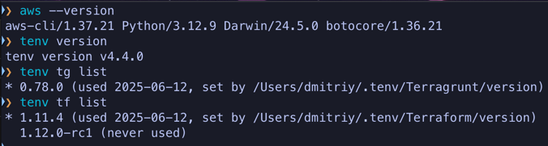
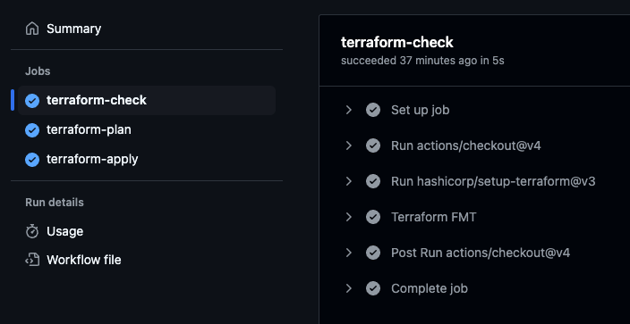

# 📦 RS School DevOps Task 1 — AWS + Terraform + GitHub Actions

## ✅ Evaluation Criteria Coverage

### 🔐 1. MFA User configured (10 points)

Если есть вопросы — [t.me/ddovguchev](https://t.me/ddovguchev)


- Создан пользователь `rs-dd-user-task-1` без root-доступа
- Подключена виртуальная MFA
- Подтверждено скриншотом из CLI и командой `aws iam list-mfa-devices`

Проверка 

---

### 🪣 2. Bucket and GithubActionsRole IAM role configured (20 points)

- Настроен AWS провайдер и backend на S3:
```hcl
terraform {
  backend "s3" {
    bucket  = "rs-school-tasks-dd"
    key     = "task1/terraform.tfstate"
    region  = "eu-west-1"
    encrypt = true
  }
}

provider "aws" {
  region = "eu-west-1"
}
```

- Создан S3-бакет с версионностью:
```hcl
resource "aws_s3_bucket" "terraform_state" {
  bucket = "rs-school-tasks-dd-2"
  tags = {
    Name        = "terraform-state"
    Environment = "dev"
  }
}

resource "aws_s3_bucket_versioning" "versioning" {
  bucket = aws_s3_bucket.terraform_state.id
  versioning_configuration {
    status = "Enabled"
  }
}
```

- IAM роль с trust policy для OIDC от GitHub:
```hcl
resource "aws_iam_openid_connect_provider" "github" {
  url             = "https://token.actions.githubusercontent.com"
  client_id_list  = ["sts.amazonaws.com"]
  thumbprint_list = ["6938fd4d98bab03faadb97b34396831e3780aea1"]
}

resource "aws_iam_role" "github_actions" {
  name = "GithubActionsRoleOIDC-DD"
  assume_role_policy = jsonencode({
    Version = "2012-10-17",
    Statement = [{
      Effect = "Allow",
      Principal = {
        Federated = "arn:aws:iam::381491972551:oidc-provider/token.actions.githubusercontent.com"
      },
      Action = "sts:AssumeRoleWithWebIdentity",
      Condition = {
        StringLike = {
          "token.actions.githubusercontent.com:sub" = "repo:ddovguchev/rsschool-devops-course-tasks:*"
        },
        StringEquals = {
          "token.actions.githubusercontent.com:aud" = "sts.amazonaws.com"
        }
      }
    }]
  })
}
```

---

### ⚙️ 3. GitHub Actions Workflow (30 points)

Workflow `terraform.yml` содержит 3 задания:

- `terraform-check` (fmt)
- `terraform-plan`
- `terraform-apply`

```yaml
on:
  push:
    branches: [main]
  pull_request:

jobs:
  terraform-check: ...
  terraform-plan: ...
  terraform-apply: ...
```

✅ Используется `aws-actions/configure-aws-credentials` с OIDC  
✅ Все шаги реализованы и проходят корректно

---

### 🧱 4. Code Organization (10 points)

✅ Структура проекта:
```
.
├── backend.tf
├── provider.tf
├── variables.tf
├── s3.tf
├── iam_oidc.tf
├── iam_policy.tf
├── main.tf
```

- Переменные вынесены в `variables.tf`
- Ресурсы разнесены по отдельным файлам

---

### 🔍 5. Verification (10 points)

✅ `terraform plan` выполняется успешно без ошибок  
✅ Логи и результат доступны в GitHub Actions

---

## 💫 Additional Tasks (20 points)

### 📘 Documentation (5 points)
✔️ Этот `README.md` описывает:
- Установку CLI
- Настройку IAM пользователя и MFA
- Структуру инфраструктуры и кода
- Запуск пайплайна
- Конфигурацию OIDC и безопасного доступа

### 🚀 Submission / GitHub Actions (5 points)
✔️ Пайплайн успешно выполняется при `push` и `pull_request`:  
`terraform-check` → `terraform-plan` → `terraform-apply`

### 🔐 Secure Authorization (10 points)
✔️ Используется OIDC от GitHub  
✔️ Нет статических ключей  
✔️ MFA включена  
✔️ Trust policy настроен по `sub` и `aud`

---

## ✅ Setup Guide

### Установка CLI:
```bash
brew install aws tenv
```

### Создание IAM пользователя с MFA:
```bash
aws iam create-user --user-name rs-dd-user-task-1
# (далее — привязка политик, создание MFA, настройка CLI профиля)
```

### Работа с Terraform:
```bash
terraform init
terraform plan
terraform apply --auto-approve
```

---

## 🖼 Скриншоты

- CLI и версии:

  

- MFA включена:

  

- GitHub Actions:

  