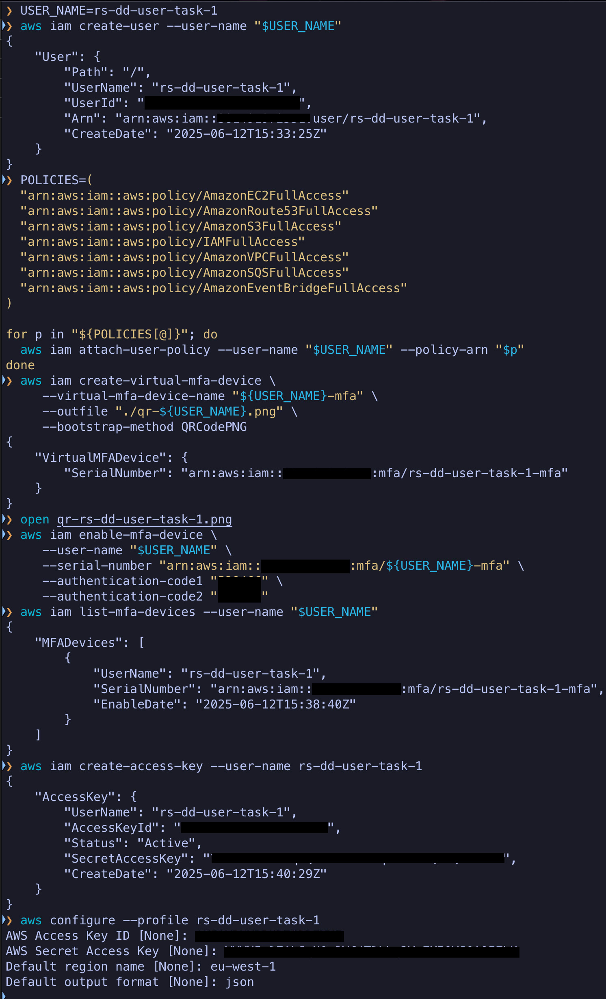
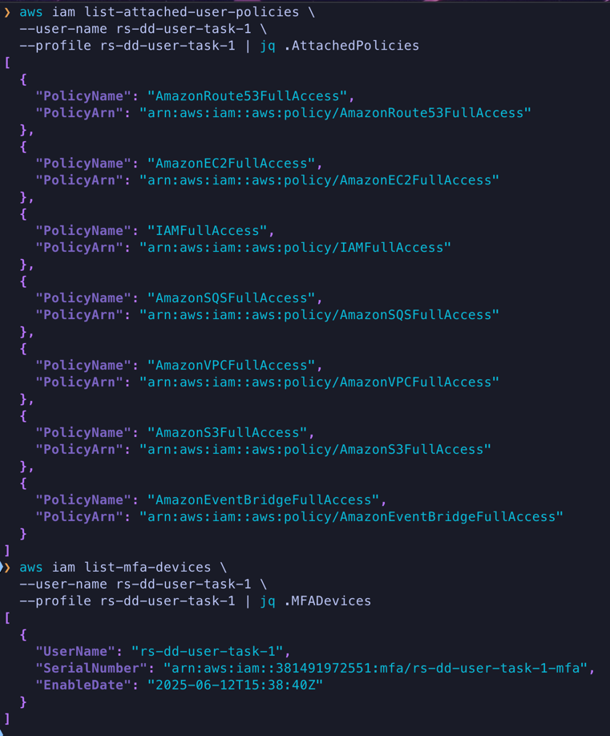

# 📦 RS School DevOps Task 1 — AWS + Terraform + GitHub Actions

## ✅ Evaluation Criteria Coverage

### 🔐 1. MFA User Configured (10 points)

If you have any questions, feel free to contact: [t.me/ddovguchev](https://t.me/ddovguchev)



- IAM user `rs-dd-user-task-1` created without root permissions
- Virtual MFA configured
- Verified via CLI and `aws iam list-mfa-devices` output

Verification: 

---

### 🪣 2. Bucket and GithubActionsRole IAM Role Configured (20 points)

- AWS provider and backend configured for S3:
```hcl
terraform {
  backend "s3" {
    bucket  = "rs-school-tasks-dd"
    key     = "task1/terraform.tfstate"
    region  = "eu-west-1"
    encrypt = true
  }
}

provider "aws" {
  region = "eu-west-1"
}
```

- Versioned S3 bucket created:
```hcl
resource "aws_s3_bucket" "terraform_state" {
  bucket = "rs-school-tasks-dd-2"
  tags = {
    Name        = "terraform-state"
    Environment = "dev"
  }
}

resource "aws_s3_bucket_versioning" "versioning" {
  bucket = aws_s3_bucket.terraform_state.id
  versioning_configuration {
    status = "Enabled"
  }
}
```

- IAM Role `GithubActionsRoleOIDC-DD` with trust policy for GitHub OIDC:
```hcl
resource "aws_iam_openid_connect_provider" "github" {
  url             = "https://token.actions.githubusercontent.com"
  client_id_list  = ["sts.amazonaws.com"]
  thumbprint_list = ["6938fd4d98bab03faadb97b34396831e3780aea1"]
}

resource "aws_iam_role" "github_actions" {
  name = "GithubActionsRoleOIDC-DD"
  assume_role_policy = jsonencode({
    Version = "2012-10-17",
    Statement = [{
      Effect = "Allow",
      Principal = {
        Federated = "arn:aws:iam::381491972551:oidc-provider/token.actions.githubusercontent.com"
      },
      Action = "sts:AssumeRoleWithWebIdentity",
      Condition = {
        StringLike = {
          "token.actions.githubusercontent.com:sub" = "repo:ddovguchev/rsschool-devops-course-tasks:*"
        },
        StringEquals = {
          "token.actions.githubusercontent.com:aud" = "sts.amazonaws.com"
        }
      }
    }]
  })
}
```

---

### ⚙️ 3. GitHub Actions Workflow (30 points)

The `terraform.yml` workflow includes:

- `terraform-check` — format validation
- `terraform-plan` — planning
- `terraform-apply` — apply to AWS

```yaml
on:
  push:
    branches: [main]
  pull_request:

jobs:
  terraform-check: ...
  terraform-plan: ...
  terraform-apply: ...
```

✅ Uses `aws-actions/configure-aws-credentials` with OIDC  
✅ All steps implemented and working correctly

---

### 🧱 4. Code Organization (10 points)

✅ Project structure:
```
.
├── backend.tf
├── provider.tf
├── variables.tf
├── s3.tf
├── iam_oidc.tf
├── iam_policy.tf
├── main.tf
```

- Variables defined in `variables.tf`
- Resources logically split into separate files

---

### 🔍 5. Verification (10 points)

✅ `terraform plan` runs successfully without errors  
✅ Logs and output available in GitHub Actions

7. **Configure an Identity Provider and Trust policies for Github Actions(Additional task)💫**

    - Update the `GithubActionsRole` IAM role with a Trust policy following the next guides
    - [IAM roles terms and concepts](https://docs.aws.amazon.com/IAM/latest/UserGuide/id_roles.html#id_roles_terms-and-concepts)
    - [Github tutorial](https://docs.github.com/en/actions/security-for-github-actions/security-hardening-your-deployments/configuring-openid-connect-in-amazon-web-services)
    - [AWS documentation on OIDC providers](https://docs.aws.amazon.com/IAM/latest/UserGuide/id_roles_create_for-idp_oidc.html#idp_oidc_Create_GitHub)
    - `GitHubOrg` is a Github `username` in this case

8. **Create a Github Actions workflow for deployment via Terraform**
    - The workflow should have 3 jobs that run on pull request and push to the default branch:
        - `terraform-check` with format checking using [terraform fmt](https://developer.hashicorp.com/terraform/cli/commands/fmt)
        - `terraform-plan` for planning deployments [terraform plan](https://developer.hashicorp.com/terraform/cli/commands/plan)
        - `terraform-apply` for deploying [terraform apply](https://developer.hashicorp.com/terraform/cli/commands/apply)
    - [terraform init](https://developer.hashicorp.com/terraform/cli/commands/init)
    - [Github actions reference](https://docs.github.com/en/actions/writing-workflows/workflow-syntax-for-github-actions)
    - [Setup terraform](https://github.com/hashicorp/setup-terraform)
    - [Configure AWS Credentials](https://github.com/aws-actions/configure-aws-credentials)

## Submission

- Create a branch `task_1` from `main` branch in your repository.
- [Create a Pull Request](https://docs.github.com/en/pull-requests/collaborating-with-pull-requests/proposing-changes-to-your-work-with-pull-requests/creating-a-pull-request) (PR) from `task_1` branch to `main`.
- Provide the code for Terraform and GitHub Actions in the PR.
- Provide screenshots of `aws --version` and `terraform version` in the PR description.
- Provide a link to the Github Actions workflow run in the PR description.
- Provide the Terraform plan output with S3 bucket (and possibly additional resources) creation in the PR description.

## Evaluation Criteria (100 points for covering all criteria)

1. **MFA User configured (10 points)**

    - Screenshot of the non-root account secured by MFA (ensure sensitive information is not shared) is presented

2. **Bucket and GithubActionsRole IAM role configured (20 points)**

    - Terraform code is created and includes:
        - Provider initialization
        - Creation of S3 Bucket

3. **Github Actions workflow is created (30 points)**

    - Workflow includes all jobs

4. **Code Organization (10 points)**

    - Variables are defined in a separate variables file.
    - Resources are separated into different files for better organization.

5. **Verification (10 points)**

    - Terraform plan is executed successfully

6. **Additional Tasks (20 points)💫**
    - **Documentation (5 points)**
    - Document the infrastructure setup and usage in a README file.
    - **Submission (5 points)**
    - A GitHub Actions (GHA) pipeline is passing
    - **Secure authorization (10 points)**
    - IAM role with correct Identity-based and Trust policies used to connect GitHubActions to AWS.