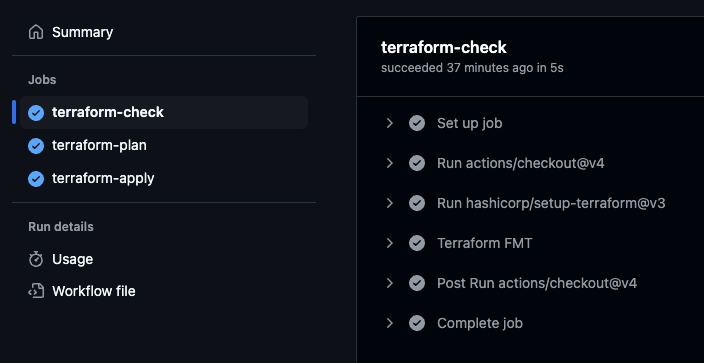

# 📦 RS School DevOps Task 1 — AWS + Terraform + GitHub Actions

## ✅ Evaluation Criteria Coverage

### 🔐 1. MFA User Configured (10 points)

If you have any questions, feel free to contact: [t.me/ddovguchev](https://t.me/ddovguchev)


- IAM user `rs-dd-user-task-1` created without root permissions
- Virtual MFA configured
- Verified via CLI and `aws iam list-mfa-devices` output

Verification: 

---

### 🪣 2. Bucket and GithubActionsRole IAM Role Configured (20 points)

- AWS provider and backend configured for S3:
```hcl
terraform {
  backend "s3" {
    bucket  = "rs-school-tasks-dd"
    key     = "task1/terraform.tfstate"
    region  = "eu-west-1"
    encrypt = true
  }
}

provider "aws" {
  region = "eu-west-1"
}
```

- Versioned S3 bucket created:
```hcl
resource "aws_s3_bucket" "terraform_state" {
  bucket = "rs-school-tasks-dd-2"
  tags = {
    Name        = "terraform-state"
    Environment = "dev"
  }
}

resource "aws_s3_bucket_versioning" "versioning" {
  bucket = aws_s3_bucket.terraform_state.id
  versioning_configuration {
    status = "Enabled"
  }
}
```

- IAM Role `GithubActionsRoleOIDC-DD` with trust policy for GitHub OIDC:
```hcl
resource "aws_iam_openid_connect_provider" "github" {
  url             = "https://token.actions.githubusercontent.com"
  client_id_list  = ["sts.amazonaws.com"]
  thumbprint_list = ["6938fd4d98bab03faadb97b34396831e3780aea1"]
}

resource "aws_iam_role" "github_actions" {
  name = "GithubActionsRoleOIDC-DD"
  assume_role_policy = jsonencode({
    Version = "2012-10-17",
    Statement = [{
      Effect = "Allow",
      Principal = {
        Federated = "arn:aws:iam::381491972551:oidc-provider/token.actions.githubusercontent.com"
      },
      Action = "sts:AssumeRoleWithWebIdentity",
      Condition = {
        StringLike = {
          "token.actions.githubusercontent.com:sub" = "repo:ddovguchev/rsschool-devops-course-tasks:*"
        },
        StringEquals = {
          "token.actions.githubusercontent.com:aud" = "sts.amazonaws.com"
        }
      }
    }]
  })
}
```

---

### ⚙️ 3. GitHub Actions Workflow (30 points)

The `terraform.yml` workflow includes:

- `terraform-check` — format validation
- `terraform-plan` — planning
- `terraform-apply` — apply to AWS

```yaml
on:
  push:
    branches: [main]
  pull_request:

jobs:
  terraform-check: ...
  terraform-plan: ...
  terraform-apply: ...
```

✅ Uses `aws-actions/configure-aws-credentials` with OIDC  
✅ All steps implemented and working correctly

---

### 🧱 4. Code Organization (10 points)

✅ Project structure:
```
.
├── backend.tf
├── provider.tf
├── variables.tf
├── s3.tf
├── iam_oidc.tf
├── iam_policy.tf
├── main.tf
```

- Variables defined in `variables.tf`
- Resources logically split into separate files

---

### 🔍 5. Verification (10 points)

✅ `terraform plan` runs successfully without errors  
✅ Logs and output available in GitHub Actions

---

## 💫 Additional Tasks (20 points)

### 📘 Documentation (5 points)
✔️ This `README.md` includes:
- CLI setup
- IAM user and MFA setup
- Infrastructure structure and code organization
- GitHub Actions pipeline configuration
- OIDC and secure authentication

### 🚀 Submission / GitHub Actions (5 points)
✔️ Pipeline runs on `push` and `pull_request`:
`terraform-check` → `terraform-plan` → `terraform-apply`

### 🔐 Secure Authorization (10 points)
✔️ GitHub OIDC authentication  
✔️ No long-lived AWS credentials  
✔️ MFA is enabled  
✔️ Proper trust policy (`sub` and `aud` conditions)

---

## ✅ Setup Guide

### Install CLI:
```bash
brew install aws tenv
```

### Create IAM user with MFA:
```bash
aws iam create-user --user-name rs-dd-user-task-1
# Then attach policies, set up MFA, and configure CLI profile
```

### Terraform usage:
```bash
terraform init
terraform plan
terraform apply --auto-approve
```

---

## 🖼 Screenshots

- CLI tools version:

  

- MFA is enabled:

  

- GitHub Actions run:

  
