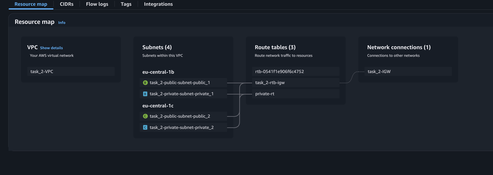

# Task 2: Basic Infrastructure Configuration

1. **Terraform Code Implementation (50 points)** ✅

   - Terraform code is created to configure the following: 
      - VPC ✅
      - 2 public subnets in different AZs ✅
      - 2 private subnets in different AZs ✅
      - Internet Gateway ✅
      - Routing configuration: ✅ 
         - Instances in all subnets can reach each other ✅
         - Instances in public subnets can reach addresses outside the VPC and vice-versa ✅

2. **Code Organization (10 points)**  ✅

   - Variables are defined in a separate variables file. ✅
   - Resources are separated into different files for better organization. ✅

3. **Verification (10 points)** ✅

   - Terraform plan is executed successfully. ✅
   - A resource map screenshot is provided (VPC -> Your VPCs -> your_VPC_name -> Resource map). ✅

4. **Additional Tasks (30 points)💫** ✅
   - **Security Groups and Network ACLs (5 points)** 
      - Implement security groups and network ACLs for the VPC and subnets. ✅
   - **Bastion Host (5 points)**
      - Create a bastion host for secure access to the private subnets. ✅
   - **NAT is implemented for private subnets (10 points)**
      - Orginize NAT for private subnets in a simpler or cheaper way ✅
      - Instances in private subnets should be able to reach addresses outside the VPC ✅
   - **Documentation (5 points)**
      - Document the infrastructure setup and usage in a README file. ✅
   - **Submission (5 points)**
   - A GitHub Actions (GHA) pipeline is set up for the Terraform code. ✅

